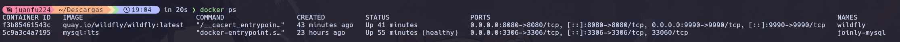
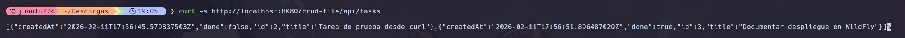
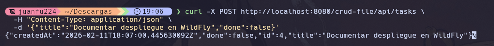
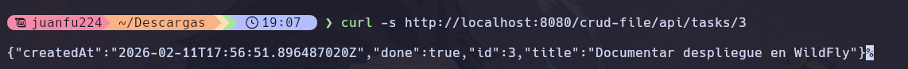
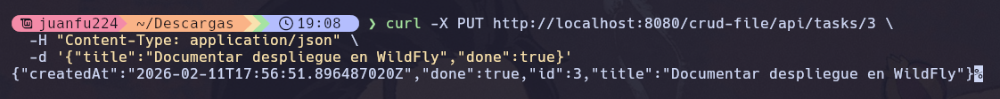
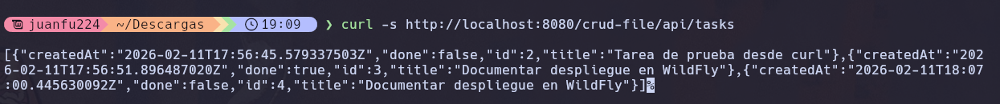
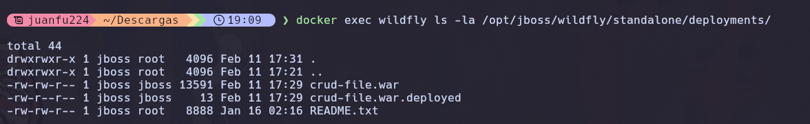

# Evidencias de Despliegue - API REST en WildFly

## Información del Proyecto

- **Nombre del WAR**: crud-file.war
- **Contexto de despliegue**: `/crud-file`
- **Ruta base de la API**: `/api`
- **URL completa**: `http://localhost:8080/crud-file/api/tasks`
- **Fecha de despliegue**: 11 de febrero de 2026

---

## 1. Contenedor WildFly Activo

### Comando ejecutado:

```bash
docker ps
```

### Salida:



### Análisis:

- Contenedor `wildfly` está **activo** y ejecutándose
- Puerto **8080** expuesto para las aplicaciones
- Puerto **9990** expuesto para la consola de administración
- Imagen utilizada: `quay.io/wildfly/wildfly:latest` (WildFly 39.0.0.Final)

---

## 2. Evidencia de Despliegue en Logs

### Comando ejecutado:

```bash
docker logs wildfly
```

### Logs relevantes del despliegue de `crud-file.war`:

```
17:31:25,276 INFO  [org.jboss.as.repository] (ServerService Thread Pool -- 79)
WFLYDR0001: Content added at location /opt/jboss/wildfly/standalone/data/content/d5/afefd03671f0150bd0f40018b2cad3ffcb2d4e/content

17:31:25,284 INFO  [org.jboss.as.server.deployment] (MSC service thread 1-2)
WFLYSRV0027: Starting deployment of "crud-file.war" (runtime-name: "crud-file.war")

17:31:26,195 INFO  [org.jboss.resteasy.resteasy_jaxrs.i18n] (ServerService Thread Pool -- 83)
RESTEASY002225: Deploying jakarta.ws.rs.core.Application: class com.example.tasks.TasksApplication

17:31:26,226 INFO  [org.hibernate.validator.internal.util.Version] (ServerService Thread Pool -- 83)
HV000001: Hibernate Validator 8.0.3.Final

17:31:26,242 INFO  [org.wildfly.extension.undertow] (ServerService Thread Pool -- 83)
WFLYUT0021: Registered web context: '/crud-file' for server 'default-server'

17:31:26,281 INFO  [org.jboss.as.server] (ServerService Thread Pool -- 79)
WFLYSRV0010: Deployed "crud-file.war" (runtime-name : "crud-file.war")
```

### Análisis:

- El contenido del WAR fue añadido al repositorio interno de WildFly
- Se inició el despliegue de `crud-file.war` correctamente
- La aplicación Jakarta RESTful (`TasksApplication`) fue desplegada exitosamente
- El contexto web `/crud-file` fue registrado en el servidor
- El despliegue se completó sin errores: **"Deployed crud-file.war"**

---

## 3. Pruebas de la API

### 3.1. GET - Listar todas las tareas

#### Navegador:

```
URL: http://localhost:8080/crud-file/api/tasks
```

#### Comando curl:

```bash
curl -s http://localhost:8080/crud-file/api/tasks
```

#### Respuesta:


**Estado HTTP**: `200 OK`

---

### 3.2. POST - Crear una nueva tarea

#### Comando curl:

```bash
curl -X POST http://localhost:8080/crud-file/api/tasks \
  -H "Content-Type: application/json" \
  -d '{"title":"Documentar despliegue en WildFly","done":false}'
```

#### Respuesta:



**Estado HTTP**: `201 Created`

---

### 3.3. GET - Obtener una tarea específica

#### Navegador:

```
URL: http://localhost:8080/crud-file/api/tasks/3
```

#### Comando curl:

```bash
curl -s http://localhost:8080/crud-file/api/tasks/3
```

#### Respuesta:



**Estado HTTP**: `200 OK`

---

### 3.4. PUT - Actualizar una tarea existente

#### Comando curl:

```bash
curl -X PUT http://localhost:8080/crud-file/api/tasks/3 \
  -H "Content-Type: application/json" \
  -d '{"title":"Documentar despliegue en WildFly","done":true}'
```

#### Respuesta:



**Estado HTTP**: `200 OK`

**Cambio**: El campo `done` cambió de `false` a `true`

---

### 3.5. DELETE - Eliminar una tarea

#### Comando curl:

```bash
curl -X DELETE http://localhost:8080/crud-file/api/tasks/1
```

#### Respuesta:

Sin contenido (cuerpo vacío)

**Estado HTTP**: `204 No Content`

---

### 3.6. Verificación después del DELETE

#### Comando curl:

```bash
curl -s http://localhost:8080/crud-file/api/tasks
```

#### Respuesta:



**Análisis**: La tarea con `id=1` fue eliminada exitosamente. Solo quedan las tareas 2 y 3.

---

## 4. Resumen de Endpoints Disponibles

| Método   | Endpoint                    | Descripción                | Estado HTTP            |
| -------- | --------------------------- | -------------------------- | ---------------------- |
| `GET`    | `/crud-file/api/tasks`      | Listar todas las tareas    | 200 OK                 |
| `GET`    | `/crud-file/api/tasks/{id}` | Obtener tarea por ID       | 200 OK / 404 Not Found |
| `POST`   | `/crud-file/api/tasks`      | Crear nueva tarea          | 201 Created            |
| `PUT`    | `/crud-file/api/tasks/{id}` | Actualizar tarea existente | 200 OK / 404 Not Found |
| `DELETE` | `/crud-file/api/tasks/{id}` | Eliminar tarea             | 204 No Content         |

---

## 5. Configuración del Proyecto

### Build Configuration ([build.gradle](../build.gradle))

```gradle
plugins {
    id 'java'
    id 'war'
}

group = 'com.example'
version = '1.0.0'

dependencies {
    compileOnly 'jakarta.platform:jakarta.jakartaee-api:10.0.0'
}

war {
    archiveFileName = 'crud-file.war'
}
```

### Aplicación REST ([TasksApplication.java](../src/main/java/com/example/tasks/TasksApplication.java))

```java
@ApplicationPath("/api")
public class TasksApplication extends Application {
}
```

### Recurso REST ([TaskResource.java](../src/main/java/com/example/tasks/TaskResource.java))

```java
@Path("/tasks")
@Produces(MediaType.APPLICATION_JSON)
@Consumes(MediaType.APPLICATION_JSON)
public class TaskResource {
    // Operaciones CRUD implementadas
}
```

---

## 6. Verificación de Archivos en el Contenedor

### Comando:

```bash
docker exec wildfly ls -la /opt/jboss/wildfly/standalone/deployments/
```

### Salida:


**Análisis**:

- El archivo `crud-file.war` está presente en el directorio de despliegues
- El archivo `.deployed` indica que el despliegue fue **exitoso**
- Tamaño del WAR: 13,591 bytes

---

## 7. Conclusiones

**Despliegue exitoso**: El archivo WAR fue correctamente desplegado en WildFly  
**Contenedor operativo**: WildFly está ejecutándose sin errores  
**API funcional**: Todos los endpoints REST responden correctamente  
**Operaciones CRUD**: Se verificaron todas las operaciones (GET, POST, PUT, DELETE)  
**Persistencia**: Las tareas se almacenan correctamente en el sistema de archivos

La API RESTful con Jakarta EE está completamente operativa en el contenedor WildFly y lista para su uso.

---

## 8. Acceso a Recursos

### Aplicación REST:

- **URL base**: http://localhost:8080/crud-file/api/tasks

### Consola de Administración WildFly:

- **URL**: http://localhost:9990
- **Usuario**: wildfly
- **Contraseña**: (configurada durante la creación del usuario)

### Página de bienvenida:

- **URL**: http://localhost:8080/crud-file/
- **Archivo**: [index.html](../src/main/webapp/index.html)

---

**Documento generado automáticamente**  
**Fecha**: 11 de febrero de 2026  
**Versión de WildFly**: 39.0.0.Final  
**Versión de Jakarta EE**: 10.0.0
