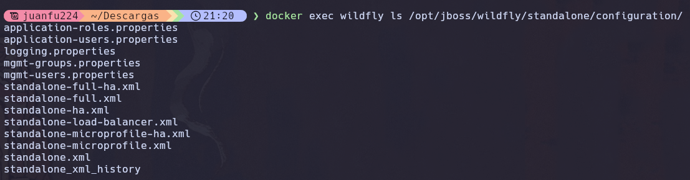

# P5.3 - Informe RA3 sobre el despliegue (WildFly contenedor + Gradle)

## a) Componentes y funcionamiento de los servicios del servidor

### Componentes que intervienen en el despliegue

1. **Docker**: Motor de contenedores que ejecuta WildFly de forma aislada. Permite levantar el servidor sin instalarlo en la maquina anfitriona.

2. **WildFly 39.0.0.Final**: Servidor de aplicaciones Jakarta EE. Se encarga de recibir las peticiones HTTP, gestionarlas y pasarlas a la aplicacion desplegada. Internamente usa **Undertow** como motor web.

3. **Aplicacion WAR (crud-file.war)**: Paquete que contiene las clases Java compiladas, el descriptor `web.xml` y los recursos estaticos (`index.html`). Es el artefacto que se despliega dentro de WildFly.

4. **Puerto 8080**: Puerto HTTP donde WildFly escucha las peticiones de las aplicaciones desplegadas.

5. **Puerto 9990**: Puerto de la consola de administracion web de WildFly. Permite gestionar el servidor, desplegar aplicaciones y modificar la configuracion.

6. **Endpoint REST (`/crud-file/api/tasks`)**: Recurso JAX-RS expuesto por la aplicacion. Acepta peticiones GET, POST, PUT y DELETE para gestionar tareas.


### Evidencias
Se encuentran en docs/EVIDENCIAS_DESPLIEGUE.md, se incluyen capturas de pantalla de cada paso del proceso de despliegue, logs del servidor y resultados de las pruebas funcionales.

## b) Archivos principales de configuracion y bibliotecas compartidas

### Archivos de configuracion de WildFly

El archivo principal de configuracion es **standalone.xml**. Esta en la siguiente ruta dentro del contenedor:

```
/opt/jboss/wildfly/standalone/configuration/standalone.xml
```

Evidencia:


#### Que ajustes se pueden tocar en standalone.xml

| Seccion | Para que sirve |
|---------|---------------|
| Datasources | Configurar conexiones a bases de datos (MySQL, PostgreSQL, etc.) |
| Logging | Cambiar nivel de log (INFO, DEBUG, etc.) y donde se guardan |
| Undertow | Ajustar el servidor web (tamano maximo de subida, puertos, etc.) |
| Security (Elytron) | Configurar dominios de seguridad, autenticacion y autorizacion |
| Interfaces | Cambiar en que IP o puerto escucha el servidor |

Para extraer el archivo y estudiarlo:

```bash
docker cp wildfly:/opt/jboss/wildfly/standalone/configuration/standalone.xml ./standalone.xml
```

### Dependencias "provided" (compileOnly)

En el archivo `build.gradle`, la dependencia de Jakarta EE esta marcada como `compileOnly`:

```gradle
dependencies {
    compileOnly 'jakarta.platform:jakarta.jakartaee-api:10.0.0'
}
```

Esto significa que la API de Jakarta EE solo se usa durante la compilacion, pero **no se incluye dentro del WAR**. La razon es que WildFly ya incluye todas estas bibliotecas (JAX-RS, CDI, JPA, etc.) como parte del servidor.

**Ventajas**:
- El WAR es mas pequeno (13 KB en vez de varios MB).
- No hay conflictos de versiones entre las bibliotecas del WAR y las del servidor.
- Las actualizaciones de seguridad de las bibliotecas se gestionan actualizando WildFly, no cada aplicacion.

---

## c) Cooperacion con el servidor web (proxy / reverse proxy) y HTTPS

### Situacion actual vs. entorno real

En la P5.2 accedemos directamente a WildFly por `localhost:8080`. En produccion, esto no es recomendable porque:

- WildFly queda expuesto directamente a internet.
- No hay HTTPS (trafico sin cifrar).
- El puerto 9990 (administracion) podria quedar accesible.

La solucion es poner un **servidor web frontal (Nginx)** como proxy inverso delante de WildFly.

### Configuracion de reverse proxy con Nginx

Archivo `docker/nginx/nginx.conf`:

```nginx
events {
    worker_connections 1024;
}

http {
    # Redirigir todo el trafico HTTP a HTTPS
    server {
        listen 80;
        server_name localhost;

        location /health {
            access_log off;
            return 200 "OK\n";
            add_header Content-Type text/plain;
        }

        location / {
            return 301 https://$host$request_uri;
        }
    }

    # Servidor HTTPS con proxy inverso hacia WildFly
    server {
        listen 443 ssl;
        server_name localhost;

        ssl_certificate     /etc/nginx/certs/server.crt;
        ssl_certificate_key /etc/nginx/certs/server.key;
        ssl_protocols       TLSv1.2 TLSv1.3;
        ssl_ciphers         HIGH:!aNULL:!MD5;

        # /api/ redirige a WildFly
        location /api/ {
            proxy_pass http://wildfly-app:8080/crud-file/api/;
            proxy_set_header Host $host;
            proxy_set_header X-Real-IP $remote_addr;
            proxy_set_header X-Forwarded-For $proxy_add_x_forwarded_for;
            proxy_set_header X-Forwarded-Proto $scheme;
        }

        location / {
            proxy_pass http://wildfly-app:8080/crud-file/;
            proxy_set_header Host $host;
            proxy_set_header X-Real-IP $remote_addr;
            proxy_set_header X-Forwarded-For $proxy_add_x_forwarded_for;
            proxy_set_header X-Forwarded-Proto $scheme;
        }
    }
}
```

### Que cambia respecto al despliegue actual

| Aspecto | Despliegue P5.2 (actual) | Con Nginx (produccion) |
|---------|-------------------------|----------------------|
| URL publica | `http://localhost:8080/crud-file/api/tasks` | `https://localhost/api/tasks` |
| Puerto expuesto al host | 8080 y 9990 | Solo 80 y 443 |
| HTTPS | No | Si (TLS en Nginx) |
| Acceso a consola 9990 | Desde fuera | Solo interno |

### Configuracion TLS (HTTPS)

Los certificados autofirmados se generaron con:

```bash
openssl req -x509 -nodes -days 365 -newkey rsa:2048 \
  -keyout docker/nginx/certs/server.key \
  -out docker/nginx/certs/server.crt \
  -subj "/CN=localhost/O=DAW/C=ES"
```

**Ventajas de TLS/HTTPS**:
- El trafico entre el cliente y el servidor va cifrado. Nadie puede leer los datos en transito.
- Protege contra ataques man-in-the-middle.
- Los navegadores modernos marcan como "no seguras" las paginas sin HTTPS.
- En produccion se usarian certificados reales (por ejemplo, de Let's Encrypt).

**No cambia nada en la aplicacion ni en WildFly**: El cifrado TLS lo gestiona Nginx. WildFly sigue comunicandose internamente por HTTP plano (puerto 8080), pero esa comunicacion es interna dentro de la red Docker y no sale al exterior.

### Evidencia de funcionamiento

```bash
$ curl -sk https://localhost/api/tasks
[]

$ curl -s http://localhost:8080/crud-file/api/tasks
curl: (7) Failed to connect to localhost port 8080: Connection refused
```

---

## d) Mecanismos de seguridad del servidor de aplicaciones

### Medidas aplicadas en P5.2

1. **Consola de administracion protegida con credenciales**: Se creo un usuario de gestion con `add-user.sh` para acceder al puerto 9990.

```bash
docker exec -it wildfly /opt/jboss/wildfly/bin/add-user.sh
```

2. **Exposicion controlada de puertos**: Solo se exponen los puertos 8080 (app) y 9990 (admin). Ningun otro servicio interno de WildFly es accesible desde fuera.

### Medidas adicionales para produccion

3. **No exponer el puerto 9990 al exterior**: En el despliegue con Docker Compose, el puerto 9990 no se publica. Solo es accesible desde dentro de la red Docker. Si un administrador necesita acceder, puede hacerlo con `docker exec`.

```yaml
# En docker-compose.yml, WildFly NO tiene "ports:"
# Solo Nginx expone 80 y 443
```

4. **Gestion de secretos**: En produccion, las contrasenas no deben estar en texto plano ni en el repositorio. Se deben usar:
   - Variables de entorno con `docker compose` (`.env` excluido del repositorio).
   - Docker Secrets para datos sensibles.
   - Ficheros `.env` anadidos al `.gitignore`.

Ejemplo:

```yaml
# .env (NO se sube al repositorio)
WILDFLY_ADMIN_USER=admin
WILDFLY_ADMIN_PASS=ContraseñaSegura123!
```

5. **Registro y trazabilidad (logs)**: WildFly genera logs en `/opt/jboss/wildfly/standalone/log/server.log`. Con Docker Compose, estos logs se almacenan en volumenes persistentes para que no se pierdan al reiniciar el contenedor.

```yaml
volumes:
  - wildfly-logs:/opt/jboss/wildfly/standalone/log
```

Se pueden consultar con:

```bash
docker logs wildfly
docker exec wildfly cat /opt/jboss/wildfly/standalone/log/server.log  # Log completo
```

6. **Uso de HTTPS obligatorio**: Como se explico en el apartado c), Nginx redirige todo el trafico HTTP a HTTPS automaticamente. Esto evita que las credenciales o datos viajen sin cifrar.

---

## e) Componentes web del servidor de aplicaciones

### Que es el WAR y que contiene

Un WAR (Web Application Archive) es un fichero ZIP con una estructura especifica que contiene todo lo necesario para ejecutar una aplicacion web en un servidor Jakarta EE.


### Que significa el contexto (context path)

El contexto es la parte de la URL que identifica a tu aplicacion dentro del servidor. WildFly asigna como contexto el nombre del archivo WAR (sin la extension).

Como nuestro WAR se llama `crud-file.war`, el contexto es `/crud-file`.

### Que parte del servidor sirve la API

**Undertow** es el motor web integrado en WildFly. Se encarga de:
- Escuchar en el puerto 8080.
- Analizar la URL de cada peticion.
- Decidir a que aplicacion (WAR) enviar la peticion segun el contexto.
- Pasar la peticion al framework JAX-RS (RESTEasy) que la procesa.


| Parte | Valor | Origen |
|-------|-------|--------|
| Protocolo | `http` | Protocolo de comunicacion |
| Host | `localhost` | Maquina donde esta Docker |
| Puerto | `8080` | Puerto publicado por Docker (`-p 8080:8080`) |
| Contexto | `/crud-file` | Nombre del WAR (`crud-file.war`) |
| Ruta de la app | `/api` | `@ApplicationPath("/api")` en `TasksApplication.java` |
| Recurso | `/tasks` | `@Path("/tasks")` en `TaskResource.java` |
| Parametro | `/3` | `@PathParam("id")` en el metodo `get()` |

### Evidencias

```bash
# Acceso desde navegador y curl
$ curl -s http://localhost:8080/crud-file/api/tasks
[{"createdAt":"2026-02-11T17:56:45.579337503Z","done":false,"id":2,"title":"Tarea de prueba desde curl"}]

# Tarea especifica
$ curl -s http://localhost:8080/crud-file/api/tasks/2
{"createdAt":"2026-02-11T17:56:45.579337503Z","done":false,"id":2,"title":"Tarea de prueba desde curl"}
```

Log del servidor mostrando el acceso:

```
INFO  [com.example.tasks.TaskResource] Listar tareas
INFO  [com.example.tasks.FileTaskStore] Operacion findAll
```

---

## f) Parametros necesarios para el despliegue

### Lista de parametros esenciales

| # | Parametro | Valor | Donde |
|---|-----------|-------|-------|
| 1 | Nombre del contenedor | `wildfly` | `docker run --name wildfly` |
| 2 | Puerto de aplicaciones | `8080:8080` | `docker run -p 8080:8080` |
| 3 | Puerto de administracion | `9990:9990` | `docker run -p 9990:9990` |
| 4 | Bind de interfaces | `-b 0.0.0.0 -bmanagement 0.0.0.0` | Comando de arranque de WildFly |
| 5 | Nombre del WAR | `crud-file.war` | `build.gradle`, seccion `war { archiveFileName }` |
| 6 | Ruta de despliegue | `/opt/jboss/wildfly/standalone/deployments/` | Directorio estandar de WildFly |
| 7 | Version de Java | `17` | `build.gradle`, `sourceCompatibility` |
| 8 | Dependencia Jakarta EE | `compileOnly 'jakarta.platform:jakarta.jakartaee-api:10.0.0'` | `build.gradle` |

### Que pasaria si un parametro estuviera mal

- **Puerto 8080 mal mapeado** (ej. `-p 9999:8080`): La aplicacion estaria en `localhost:9999` en vez de `localhost:8080`. Si no lo sabemos, parece que no funciona.

- **Sin `-b 0.0.0.0`**: WildFly solo escucharia en `127.0.0.1` dentro del contenedor. Desde fuera no se podria acceder a la aplicacion.

- **Sin `-bmanagement 0.0.0.0`**: La consola de administracion (9990) no seria accesible desde el navegador del host. Daria error de redireccion.

- **Nombre del WAR diferente**: Si el WAR se llamara `mi-app.war`, el contexto cambiaria a `/mi-app` y la URL seria `http://localhost:8080/mi-app/api/tasks`. La URL antigua dejaria de funcionar.

- **Version de Java incorrecta**: Si compilamos con Java 21 pero WildFly espera Java 17, podria haber errores de compatibilidad al desplegar.

### Evidencias

Comando completo de `docker run` usado:

```bash
docker run -d --name wildfly -p 8080:8080 -p 9990:9990 \
  quay.io/wildfly/wildfly:latest \
  /opt/jboss/wildfly/bin/standalone.sh -b 0.0.0.0 -bmanagement 0.0.0.0
```

Comando de despliegue:

```bash
docker cp build/libs/crud-file.war wildfly:/opt/jboss/wildfly/standalone/deployments/
```

Fragmento del `build.gradle`:

```gradle
plugins {
    id 'java'
    id 'war'
}
group = 'com.example'
version = '1.0.0'

java {
    sourceCompatibility = JavaVersion.VERSION_17
    targetCompatibility = JavaVersion.VERSION_17
}

dependencies {
    compileOnly 'jakarta.platform:jakarta.jakartaee-api:10.0.0'
}

war {
    archiveFileName = 'crud-file.war'
}
```

---

## g) Pruebas de funcionamiento y rendimiento

### Pruebas funcionales realizadas en P5.2

#### GET - Listar tareas

```bash
$ curl -s http://localhost:8080/crud-file/api/tasks
[{"createdAt":"2026-02-11T17:56:45.579337503Z","done":false,"id":2,"title":"Tarea de prueba desde curl"}]
```

#### POST - Crear tarea

```bash
$ curl -X POST http://localhost:8080/crud-file/api/tasks \
  -H "Content-Type: application/json" \
  -d '{"title":"Documentar despliegue en WildFly","done":false}'

{"createdAt":"2026-02-11T17:56:51.896487020Z","done":false,"id":3,"title":"Documentar despliegue en WildFly"}
```

Estado HTTP: 201 Created.

#### GET - Obtener tarea por ID

```bash
$ curl -s http://localhost:8080/crud-file/api/tasks/3
{"createdAt":"2026-02-11T17:56:51.896487020Z","done":false,"id":3,"title":"Documentar despliegue en WildFly"}
```

#### PUT - Actualizar tarea

```bash
$ curl -X PUT http://localhost:8080/crud-file/api/tasks/3 \
  -H "Content-Type: application/json" \
  -d '{"title":"Documentar despliegue en WildFly","done":true}'

{"createdAt":"2026-02-11T17:56:51.896487020Z","done":true,"id":3,"title":"Documentar despliegue en WildFly"}
```

El campo `done` cambio de `false` a `true`.

#### DELETE - Eliminar tarea

```bash
$ curl -X DELETE http://localhost:8080/crud-file/api/tasks/1
# Sin contenido. Estado HTTP: 204 No Content
```

### Prueba de rendimiento con ApacheBench (ab)

Se ejecuto una prueba de rendimiento contra el endpoint de listado de tareas accediendo directamente a WildFly.

**Comando ejecutado**:

```bash
ab -n 200 -c 10 http://localhost:8080/crud-file/api/tasks
```

- `-n 200`: 200 peticiones en total.
- `-c 10`: 10 peticiones simultaneas (concurrencia).

**Nota**: La prueba se realiza contra HTTP directo en WildFly (puerto 8080) porque ApacheBench tiene problemas de compatibilidad con certificados autofirmados cuando se usa HTTPS. En produccion con certificados reales, el rendimiento con HTTPS seria similar.

**Resultado completo**:

```
Server Software:        
Server Hostname:        localhost
Server Port:            8080

Document Path:          /crud-file/api/tasks
Document Length:        2 bytes

Concurrency Level:      10
Time taken for tests:   0.177 seconds
Complete requests:      200
Failed requests:        0
Total transferred:      25600 bytes
HTML transferred:       400 bytes
Requests per second:    1131.59 [#/sec] (mean)
Time per request:       8.837 [ms] (mean)
Time per request:       0.884 [ms] (mean, across all concurrent requests)
Transfer rate:          141.45 [Kbytes/sec] received

Connection Times (ms)
              min  mean[+/-sd] median   max
Connect:        0    0   0.5      0       4
Processing:     3    8   3.3      8      22
Waiting:        3    8   3.3      7      22
Total:          3    8   3.3      8      22

Percentage of the requests served within a certain time (ms)
  50%      8
  66%      9
  75%     10
  80%     11
  90%     13
  95%     14
  98%     18
  99%     20
 100%     22 (longest request)
```

**Analisis de resultados**:

| Metrica | Valor | Interpretacion |
|---------|-------|---------------|
| Peticiones/segundo | 1131.59 | Excelente rendimiento para un entorno de desarrollo |
| Tiempo medio por peticion | 8.84 ms | Muy rapido, respuesta casi instantanea |
| Peticiones fallidas | 0 | Sin errores, la aplicacion es completamente estable |
| Tiempo maximo | 22 ms | Todas las peticiones son rapidas y consistentes |
| Mediana (50%) | 8 ms | Rendimiento muy consistente |

---

## h) Documentacion de administracion y recomendaciones

### Guia de administracion del despliegue

#### Requisitos previos

- Docker instalado y funcionando (`docker --version`).
- Gradle o el wrapper del proyecto (`./gradlew`).
- Java 17 para compilar.

#### 1. Levantar WildFly

**Opcion A: Contenedor individual (desarrollo)**

```bash
# Levantar WildFly
docker run -d --name wildfly -p 8080:8080 -p 9990:9990 \
  quay.io/wildfly/wildfly:latest \
  /opt/jboss/wildfly/bin/standalone.sh -b 0.0.0.0 -bmanagement 0.0.0.0

# Crear usuario de administracion
docker exec -it wildfly /opt/jboss/wildfly/bin/add-user.sh
```

**Opcion B: Docker Compose (produccion)**

```bash
cd docker/
docker compose up -d
```

Esto levanta Nginx (proxy con HTTPS) + WildFly automaticamente.

#### 2. Compilar y desplegar una nueva version del WAR

```bash
# Compilar el proyecto
./gradlew clean build

# Copiar el WAR al contenedor (Opcion A)
docker cp build/libs/crud-file.war wildfly:/opt/jboss/wildfly/standalone/deployments/

# Con Docker Compose (Opcion B), el WAR se monta automaticamente:
cp build/libs/crud-file.war docker/deployments/
docker compose restart wildfly
```

#### 3. Comprobar el estado

```bash
# Ver si el contenedor esta activo
docker ps

# Ver logs del servidor
docker logs -f wildfly

# Probar el endpoint
curl -s http://localhost:8080/crud-file/api/tasks

# Con Docker Compose (via Nginx)
curl -sk https://localhost/api/tasks
```

Buscar en los logs la linea: `WFLYSRV0010: Deployed "crud-file.war"`.

#### 4. Recomendaciones para evitar errores comunes

| Problema | Causa | Solucion |
|----------|-------|---------|
| No se puede acceder a `localhost:8080` | Falta `-b 0.0.0.0` en el comando de arranque | Recrear el contenedor con el parametro correcto |
| Error de redireccion en la consola 9990 | Falta `-bmanagement 0.0.0.0` | Recrear el contenedor con el parametro correcto |
| El WAR no se despliega | No aparece el fichero `.deployed` | Revisar logs con `docker logs wildfly` y buscar errores |
| Aparece fichero `.failed` en deployments | Error en el WAR (compilacion o configuracion) | Revisar el error en logs, recompilar con `./gradlew clean build` |
| Se pierden datos al reiniciar | Los datos estan dentro del contenedor sin volumen | Usar volumenes Docker para persistir datos |
| Puerto ocupado | Otro servicio usa 8080 o 9990 | Cambiar el mapeo: `-p 8081:8080` |

#### Arquitectura del despliegue con Docker Compose

```
Internet / Navegador
        |
   Puerto 80/443
        |
   [Nginx (proxy)]  -- HTTPS, reverse proxy
        |
   Red interna Docker
        |
   Puerto 8080 (interno)
        |
   [WildFly]  -- Servidor de aplicaciones
        |
   [crud-file.war]  -- Aplicacion REST
```

#### Ficheros relevantes del proyecto

```
proyecto/
|-- build.gradle              # Configuracion de Gradle
|-- src/main/java/            # Codigo fuente Java
|-- src/main/webapp/          # Recursos web (index.html, web.xml)
|-- build/libs/crud-file.war  # WAR generado
|-- docker/
|   |-- docker-compose.yml    # Orquestacion de contenedores
|   |-- deployments/          # WAR para docker-compose
|   |-- nginx/
|       |-- nginx.conf        # Configuracion del proxy inverso
|       |-- certs/            # Certificados TLS
```

---

## i) Virtualizacion, nube o contenedores en el despliegue

### Despliegue con Docker Compose

Se ha creado un despliegue completo con Docker Compose que une Nginx + WildFly + la aplicacion REST.

#### Archivo docker-compose.yml

```yaml
services:

  wildfly:
    image: quay.io/wildfly/wildfly:latest
    container_name: wildfly-app
    command: /opt/jboss/wildfly/bin/standalone.sh -b 0.0.0.0 -bmanagement 0.0.0.0
    user: root
    volumes:
      - wildfly-logs:/opt/jboss/wildfly/standalone/log
      - wildfly-data:/opt/jboss/wildfly/standalone/data
      - ./deployments/crud-file.war:/opt/jboss/wildfly/standalone/deployments/crud-file.war
    networks:
      - internal
    healthcheck:
      test: ["CMD", "curl", "-f", "http://localhost:8080/crud-file/api/tasks"]
      interval: 15s
      timeout: 5s
      retries: 5
      start_period: 30s
    restart: unless-stopped
    deploy:
      resources:
        limits:
          memory: 512M
          cpus: "1.0"

  nginx:
    image: nginx:alpine
    container_name: nginx-proxy
    ports:
      - "80:80"
      - "443:443"
    volumes:
      - ./nginx/nginx.conf:/etc/nginx/nginx.conf:ro
      - ./nginx/certs:/etc/nginx/certs:ro
      - nginx-logs:/var/log/nginx
    depends_on:
      wildfly:
        condition: service_healthy
    networks:
      - internal
    healthcheck:
      test: ["CMD", "wget", "-q", "-O", "/dev/null", "http://127.0.0.1/health"]
      interval: 15s
      timeout: 5s
      retries: 3
    restart: unless-stopped
    deploy:
      resources:
        limits:
          memory: 128M
          cpus: "0.5"

volumes:
  wildfly-logs:
  wildfly-data:
  nginx-logs:

networks:
  internal:
```

#### Explicacion de cada caracteristica

**Volumenes**:
- `wildfly-logs`: Persiste los logs de WildFly fuera del contenedor. Si se reinicia o elimina el contenedor, los logs no se pierden.
- `wildfly-data`: Persiste los datos de la aplicacion (fichero `tasks.json`).
- `nginx-logs`: Persiste los logs de acceso de Nginx.
- Los certificados TLS y la configuracion de Nginx se montan como solo lectura (`:ro`).

**Healthchecks**:
- WildFly: Hace un `curl` al endpoint de la API cada 15 segundos. Si falla 5 veces seguidas, Docker marca el contenedor como unhealthy.
- Nginx: Verifica con `wget` que el endpoint `/health` responde cada 15 segundos. Se usa `wget` en vez de `curl` porque la imagen `nginx:alpine` no incluye `curl`.
- El healthcheck de WildFly tiene `start_period: 30s` para darle tiempo a arrancar antes de empezar a comprobar.

**Reinicio automatico**:
- `restart: unless-stopped`: Si el contenedor se cae, Docker lo reinicia automaticamente. Solo se detiene si el administrador lo para manualmente.

**Limitacion de recursos**:
- WildFly: Maximo 512 MB de RAM y 1 CPU.
- Nginx: Maximo 128 MB de RAM y 0.5 CPU.
- Esto evita que un contenedor consuma todos los recursos del servidor.

**Redes**:
- Red `internal` de tipo bridge: Los contenedores se comunican entre si por nombre (ej. `wildfly-app:8080`), pero WildFly no expone puertos al host.
- Solo Nginx expone los puertos 80 y 443 al exterior.

**Seguridad**:
- WildFly no tiene seccion `ports:`, por lo que el puerto 8080 y 9990 no son accesibles desde fuera.
- Los certificados TLS estan en un directorio dedicado.
- La configuracion de Nginx se monta como solo lectura.

#### Como usarlo

```bash
# 1. Generar certificados TLS (solo la primera vez)
mkdir -p docker/nginx/certs
openssl req -x509 -nodes -days 365 -newkey rsa:2048 \
  -keyout docker/nginx/certs/server.key \
  -out docker/nginx/certs/server.crt \
  -subj "/CN=localhost/O=DAW/C=ES"

# 2. Compilar el proyecto
./gradlew clean build

# 3. Copiar el WAR
mkdir -p docker/deployments
cp build/libs/crud-file.war docker/deployments/

# 4. Levantar todo
cd docker/
docker compose up -d

# 5. Verificar
docker compose ps
curl -sk https://localhost/api/tasks
```

#### Evidencias de funcionamiento
Se encuentran en docs/EVIDENCIAS_DESPLIEGUE.md, incluyendo capturas de pantalla de `docker compose ps`, logs de ambos contenedores y resultados de las pruebas funcionales a través de Nginx.
